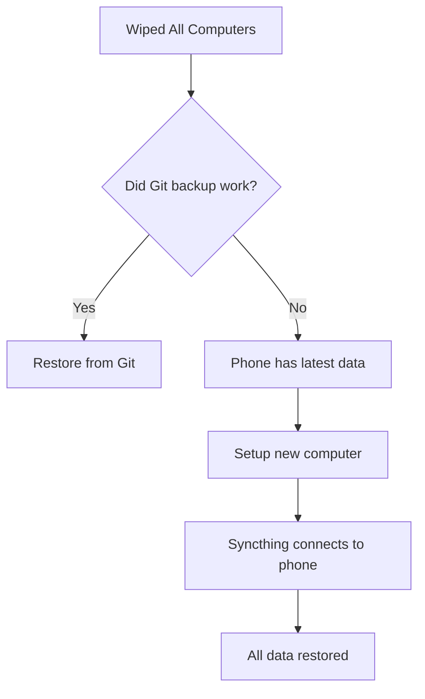

# Private Notes Sync System

A robust solution for maintaining private notes/diary across multiple devices
with automatic backups and sync capabilities.

## Goals

- Real-time sync across unlimited devices
- Survive system resets/wipes
- Work offline
- Support mobile devices
- Maintain version history
- Keep data private and secure
- Minimal maintenance required

## Architecture

### Components

1. **Syncthing**
   - Handles real-time sync between devices
   - Provides local version history
   - Works offline
   - Supports mobile devices

2. **Git Backup**
   - Remote backup on private GitHub repository
   - Additional version history
   - Survives complete system wipes
   - Automated commits and pushes

### Directory Structure

```
~/private-notes/          # Main notes directory
├── .git/                 # Git repository
├── .stfolder/           # Syncthing folder
├── .stversions/         # Syncthing versions
└── content/             # Actual notes
```

## Implementation

### NixOS/nix-darwin Configuration

```nix
{
  services.syncthing = {
    enable = true;
    user = "yourusername";
    dataDir = "/Users/yourusername";  # /home/yourusername on Linux
    folders = {
      "private-notes" = {
        path = "/Users/yourusername/private-notes";
        versioning = {
          type = "staggered";
          params = {
            maxAge = "30d";
          };
        };
      };
    };
  };

  # Automated Git backup
  launchd.user.agents.backup-private-notes = {
    serviceConfig = {
      ProgramArguments = [ "${pkgs.bash}/bin/bash" "/Users/yourusername/bin/backup-private-notes" ];
      StartInterval = 3600;
      KeepAlive = false;
      StandardOutPath = "/Users/yourusername/Library/Logs/backup-private-notes.log";
      StandardErrorPath = "/Users/yourusername/Library/Logs/backup-private-notes.error.log";
    };
  };
}
```

### Backup Script

```bash
#!/usr/bin/env bash
# ~/bin/backup-private-notes

NOTES_DIR="$HOME/private-notes"
REPO_URL="git@github.com:yourusername/private-notes.git"

# Initialize git repo if needed
if [ ! -d "$NOTES_DIR/.git" ]; then
    cd "$NOTES_DIR"
    git init
    git remote add origin "$REPO_URL"
    echo ".stfolder" > .gitignore
    echo ".stversions" >> .gitignore
fi

cd "$NOTES_DIR"
if ! git diff --quiet || git ls-files --others --exclude-standard | grep -q '^'; then
    git add .
    git commit -m "Auto-backup $(date)"
    git push origin main || true
fi
```

## Setup Instructions

1. **Initial Repository Setup**
   ```bash
   # Create private GitHub repository
   gh repo create private-notes --private

   # Clone and setup locally
   git clone git@github.com:yourusername/private-notes.git ~/private-notes
   ```

2. **Configure Syncthing**
   - Install Syncthing on all devices
   - Add devices to Syncthing network
   - Share the private-notes folder

3. **Mobile Setup**
   - Install Syncthing app
   - Add device to Syncthing network
   - Enable folder sync

4. **System Recovery**
   ```bash
   # After system reset, just clone and restart Syncthing
   git clone git@github.com:yourusername/private-notes.git ~/private-notes
   # Syncthing will automatically detect and sync
   ```

## Security Considerations

- All Syncthing traffic is encrypted
- Git repository should be private
- SSH keys needed for Git access
- No cloud services involved (except GitHub backup)
- Data exists in three places:
  1. Local device
  2. Other synced devices
  3. GitHub backup

## Maintenance

- Periodically verify Git backups are working
- Check Syncthing status on devices
- Consider pruning old versions periodically
- Backup SSH keys and GitHub access

## Future Improvements

- [ ] Add encryption at rest
- [ ] Implement backup rotation
- [ ] Add status monitoring
- [ ] Create setup automation script
- [ ] Add conflict resolution documentation

## Safety Nets (Multiple Layers)

1. **Git Backup** (Primary)
   - Remote repository
   - Version history
   - Manual recovery possible

2. **Mobile Device** (Secondary)
   - Naturally resistant to "nuke all computers" events
   - Separate physical device
   - Different update/maintenance cycle
   - iOS data persistence
   - Automatic recovery path via Syncthing

3. **Syncthing Versions** (Tertiary)
   - Local version history
   - Conflict resolution
   - 30-day retention

### Recovery Priority Flow

1. Try Git repository first
2. If Git fails, use mobile device as source
3. If both fail, check local .stversions

### Recovery Flow



## Development Workflow

### Script Development Flow

1. **Initial Development** (Private Repo)
   - Write scripts without worrying about secrets
   - Include real paths, tokens, passwords during testing
   - Keep sensitive test data
   - Rapid prototyping without public exposure

2. **Refinement Process**
   - Remove hardcoded secrets
   - Parameterize personal paths
   - Add proper error handling
   - Write documentation
   - Add configuration options

3. **Migration to Public** (nix-config)
   - Move cleaned scripts to public repo
   - Replace secrets with environment variables
   - Use config files for personal settings
   - Add to proper module structure

### Benefits

- Safe development environment
- No accidental secret commits
- Natural progression from prototype to production
- Keep development notes with scripts
- History of development process stays private
