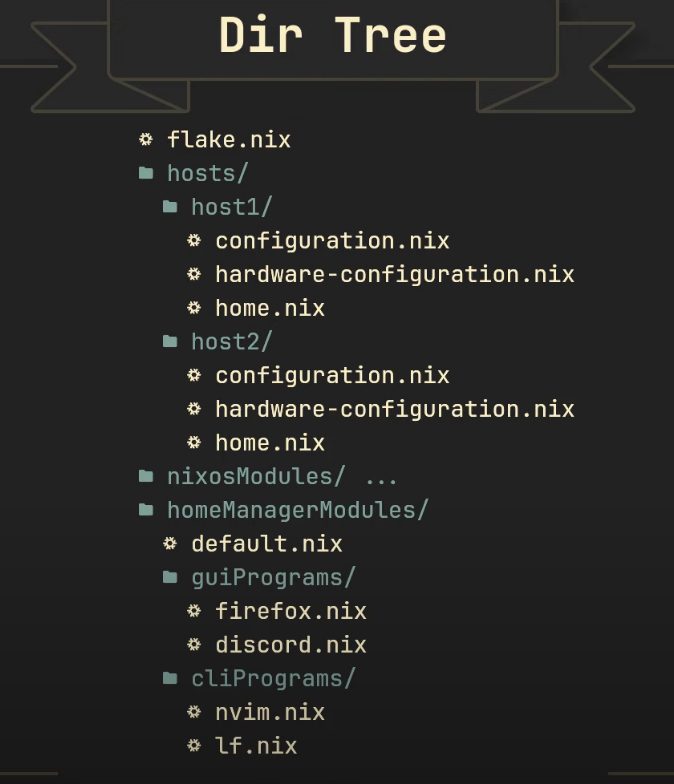

## TODOS

- [ ] Create basic nix-config with subflakes
- [ ] Move the good parts from v1-nix-config/darwin to the new nix-config
- [ ] Move the good parts from v1-nix-config/linux to the new nix-config
- [ ] Make sure we put configurations in the right places
  - If something can easily be done in a single flake, do it there
  - If not, try to do it in the main direnv flake
  - If not, try to do it in home-manager config
  - If it turns out that we HAVE to do it in the system configuration, do it there
    - Leave a comment with a unique ID and document in this README, so we can easily find it later
    - Our goal is to keep the system configuration as minimal as possible so that the configuration can work in any system with nix installed
    - Because my goal is to create good profiles of those flakes and use them in devenv of projects
    - Integrate things like devbox if they are useful
- [ ] Add multi-user support for darwin
- [ ] Research lorri and integrate it
- [ ] Research niv and integrate it if needed
- [ ] Add monaspace font
- [ ] 

## Structure

The structure is heavily inspired by [this amazing youtube video](https://www.youtube.com/watch?v=vYc6IzKvAJQ) from @vimjoyer



### How do I avoid github rate limiting?

First login:

```sh
gh auth login
```

Then set `NIX_CONFIG` environment variable

```sh
export NIX_CONFIG="extra-access-tokens = github.com=$(gh auth token)"
```

Or even better
```sh
alias nix="NIX_CONFIG=\"extra-access-tokens = github.com=$(gh auth token)\" nix"
alias niv="NIX_CONFIG=\"extra-access-tokens = github.com=$(gh auth token)\" niv"
```
